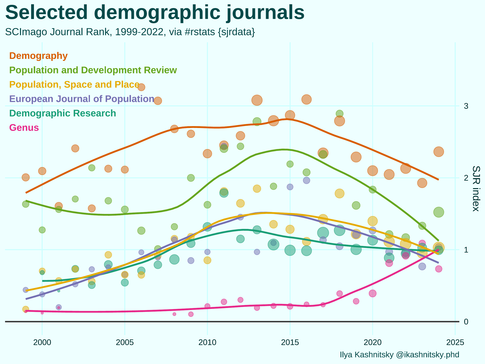

# **sjrdata: all SCImago Journal & Country Rank data, ready for R**  <a href='https://github.com/ikashnitsky/sjrdata'></a>

<!-- badges: start -->
[](https://github.com/ikashnitsky/sjrdata) 
[](https://github.com/ikashnitsky/sjrdata) 
[](https://github.com/ikashnitsky/sjrdata/graphs/contributors)    
 
 


<!-- badges: end -->


SCImago Journal & Country Rank provides valuable estimates of academic journals' prestige. The data is freely available at https://www.scimagojr.com and is distributed for deeper analysis in forms of .csv and .xlsx files. I downloaded all the files and pooled them together, ready to be used in R.



# How to use `sjrdata`

Install the package from github, load it and use the data. 

The installation will take a while since the main dataset `sjr_journals` is pretty heavy (23.7MB compressed).

```{r}
# install
devtools::install_github("ikashnitsky/sjrdata")

# load
library(sjrdata)

# use
View(sjr_countries)
```

Basically, all the package gives you three easily accessible data frames: `sjr_journals` (Journal Rank), `sjr_countries` (Country Rank, year-by-year), and `sjr_countries_total` (Country Rank, all years together).


***

# Information from the authors of the data

>The SCImago Journal & Country Rank is a publicly available portal that includes the journals and country scientific indicators developed from the information contained in the Scopus® database (Elsevier B.V.). These indicators can be used to assess and analyze scientific domains. Journals can be compared or analysed separately. Country rankings may also be compared or analysed separately. Journals can be grouped by subject area (27 major thematic areas), subject category (313 specific subject categories) or by country. Citation data is drawn from over 34,100 titles from more than 5,000 international publishers and country performance metrics from 239 countries worldwide. The SJCR allows you also to embed significative journal metrics into your web as a clickable image widget

>This platform takes its name from the SCImago Journal Rank (SJR) indicator (PDF), developed by SCImago from the widely known algorithm Google PageRank™. This indicator shows the visibility of the journals contained in the Scopus® database from 1996.

>SCImago is a research group from the Consejo Superior de Investigaciones Científicas (CSIC), University of Granada, Extremadura, Carlos III (Madrid) and Alcalá de Henares, dedicated to information analysis, representation and retrieval by means of visualisation techniques.

> As well as the SJR Portal, SCImago has developed The Shape of Science, the SIR (SCImago Institution Rankings) and the Atlas of Science. The Shape of Science is an information visualization project whose aim is to reveal the structure of science. Its interface has been designed to access the bibliometric indicators database of the SCImago Journal & Country Rank portal.The SIR is a classification of academic and research-related institutions ranked by a composite indicator that combines three different sets of indicators based on research performance, innovation outputs and societal impact measured by their web visibility. The Atlas of Science project proposes the creation of an information system whose major aim is to achieve a graphic representation of IberoAmerican Science Research. Such representation is conceived as a collection of interactive maps, allowing navigation functions throughout the semantic spaces formed by the maps.

> Contact e-mail: scimagojr@scimago.es

# How to cite the dataset

>SCImago, (n.d.). SJR — SCImago Journal & Country Rank [Portal]. Retrieved Date you Retrieve, from http://www.scimagojr.com
